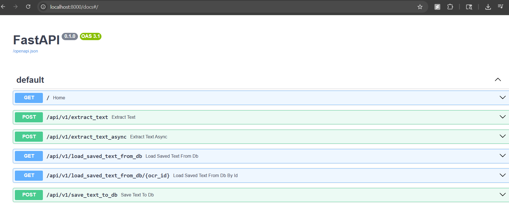

# Vision Text OCR Service

This project is the backend API service for the Vision Text OCR application. A service that captures text from images using optical character recognition. See frontend ui service [here](https://github.com/hartake/vision-text-ocr-ui)

## Purpose

This FastAPI service provides REST endpoints for uploading images and extracting text from them using OCR technology. It processes image files, runs OCR analysis, and stores the extracted text in a PostgreSQL database for future retrieval.

## Core Technology Stack

- **FastAPI:** A modern, fast web framework for building APIs with Python.
- **PostgreSQL:** A relational database for storing OCR results.
- **asyncpg:** An asynchronous PostgreSQL database adapter for Python.
- **pytesseract:** Python wrapper for Google's Tesseract OCR engine.
- **Pydantic:** Data validation and settings management using Python type annotations.

## Architecture

This service is the backend component of a client-server decoupled full-stack application. It handles the core business logic, image processing, OCR operations, and data persistence for the Vision Text application. It provides a REST API that the frontend React application consumes.

## API Endpoints

- `POST /api/v1/extract_text_async` - Upload images and extract text asynchronously
- `GET /api/v1/load_saved_text_from_db` - Retrieve saved OCR results
- `GET /api/v1/load_saved_text_from_db/{id}` - Retrieve a specific OCR result by ID
- `POST /api/v1/save_text_to_db` - Save OCR text to database

## Start Up
- Run with`python main.py` for development or `uvicorn main:app` in terminal

## API Preview

